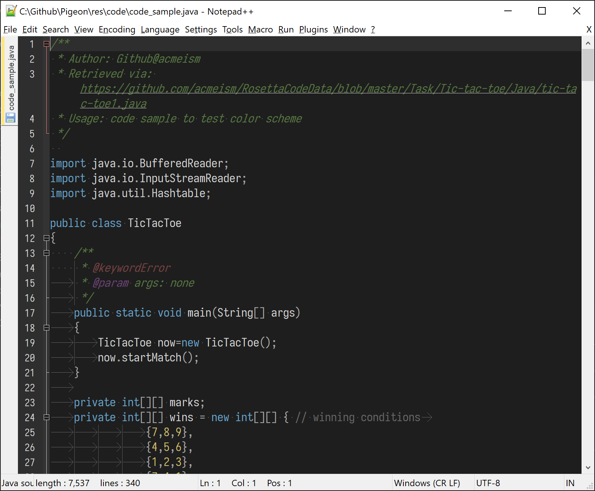

# Pigeon Dark for [Notepad++](https://notepad-plus-plus.org/)

A dark theme for [Notepad++](https://notepad-plus-plus.org/)


Screenshot info: Notepad++ v7.9.1, Dec 26th, 2020.

## Install

Notepad++ can customize via moving file to path `Notepad++/themes/` or using Notepad++ built-in `import` feature.

**Prerequisite**:

- Notepad++ installed
- File `PigeonDark.xml`
  - via wget:  

    ```powershell
    wget https://raw.githubusercontent.com/Moenupa/Pigeon/master/src/Pigeon_Dark/notepad_plusplus/PigeonDark.xml
    ```  

  - via clipboard: [PigeonDark.xml](./PigeonDark.xml)

**Procedures**:

1. Go to path `%AppData%\Notepad++\themes`
1. Place `PigeonDark.xml` inside that folder
1. Restart Notepad++
1. PigeonDark will be available in `Settings` > `Style Configurator`

## Support

Pigeon Supports syntax highlighting of the following languages (or file extensions):

|ALPHA|LANGs|   |   |   |   |   |
|:---:|---|---|---|---|---|---|
|  A  | ASP | Assembly | AutoIt
|  B  | Batch |
|  C  | C | C++ | C# | CSS
|  D  | Diff |
|  H  | Haskell | HTML
|  I  | INI |
|  J  | Java |JavaScript|JSON
|  K  | KiXtart|
|  L  | LaTeX|LISP|Lua
|  M  | Makefile|Matlab
|  O  | Objective-C|
|  P  | Pascal|Perl|PHP|PowerShell|Properties|Python
|  R  | R|RC|Ruby|Rust
|  S  | SQL|
|  T  | TCL|TeX
|  V  | Visual Basic|
|  X  | XML|
|  Y  | YAML|

## License

MIT LICENSE
